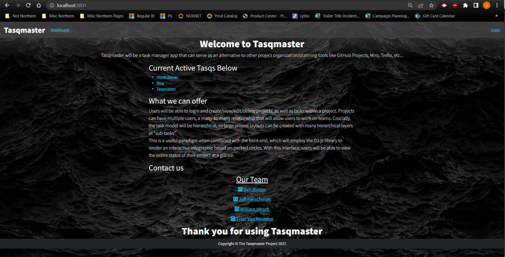

# TasqMaster

## <strong>Description</strong>

Group Project 2, we are tasked with creating a real-world full-stack application that you'll be able to showcase to potential employers. The following section are some basic requirements.

## <strong>Acceptance Criteria</strong>

    Use Node.js and Express.js to create a RESTful API.

    Use Handlebars.js as the templating engine.

    Use MySQL and the Sequelize ORM for the database.

    Have both GET and POST routes for retrieving and adding new data.

    Be deployed using Heroku (with data).

    Use at least one new library, package, or technology that we haven’t discussed.

    Have a polished UI.

    Be responsive.

    Be interactive (i.e., accept and respond to user input).

    Have a folder structure that meets the MVC paradigm.

    Include authentication (express-session and cookies).

    Protect API keys and sensitive information with environment variables.

    Have a clean repository that meets quality coding standards (file structure, naming conventions, follows best practices for class/id naming conventions, indentation, quality comments, etc.).

    Have a quality README (with unique name, description, technologies used, screenshot, and link to deployed application).

## <strong>Criteria Met</strong>

♦ Successfully integrated all reqested acceptance criteria into a working and functional Tasqmaster database

♦ Prettier Compliant

♦ Successful Heroku Launch

### <strong>Website Link</strong>

https://github.com/binderb/tasqmaster

### <strong>Screenshot</strong>

### <strong>Video Requirement</strong>

https://drive.google.com/file/d/1_pztXHNyWQDqWCLwuIeZae9V-lnq-Tr_/view

### <strong>Contact Information</strong>

https://github.com/FleischmanJ88

https://github.com/binderb

https://github.com/Tvanmeveren

https://github.com/WilliamHirschh
